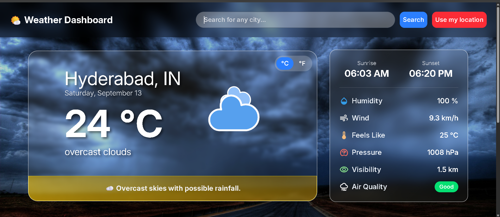
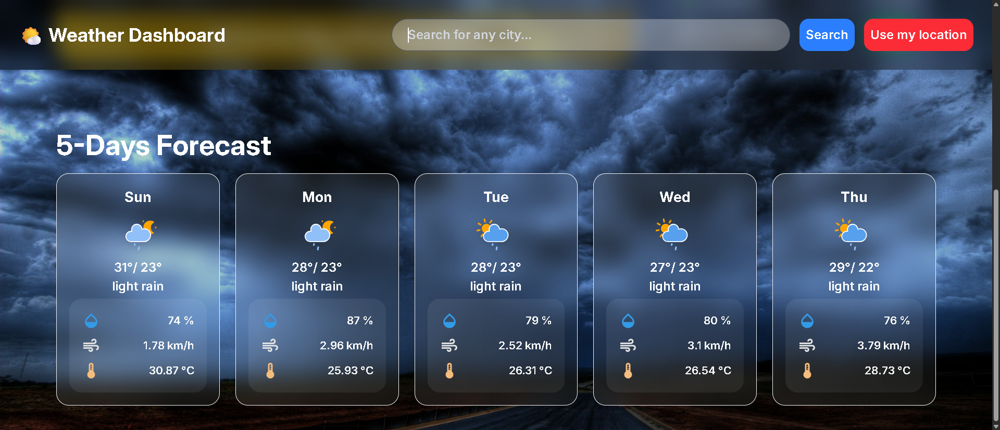
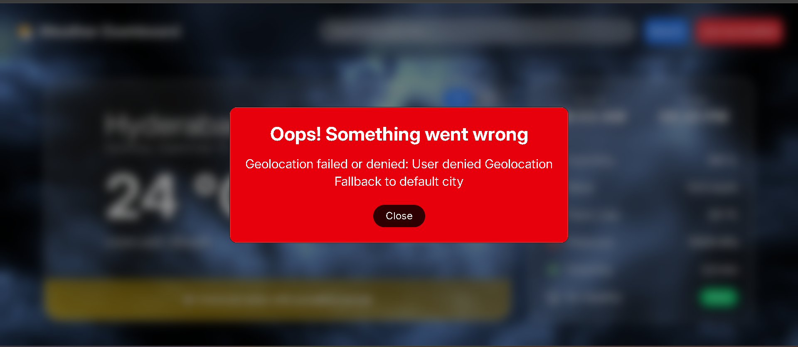

# 🌤️ Weather Forecast Application

## 📌 Introduction
The **Weather Forecast Application** is a web-based project built with **JavaScript, HTML, and Tailwind CSS**.  
Its primary purpose is to deliver real-time weather updates, provide a 5-day extended forecast, and display recently searched cities.

The app integrates with the **OpenWeatherMap API** to fetch accurate weather data, delivering a clean and interactive user experience.  

---

## ✨ Features
- 🌍 **Search by City**  
- 📍 **Current Location Support**  
- 📜 **Recently Searched Cities**  
- 🔄 **Temperature Unit Toggle (°C / °F)**  
- ⚠️ **Weather Alerts for extreme temps**  
- 🌅 **Sunrise & Sunset**  
- 📅 **5-Day Forecast**  
- 📱 **Fully Responsive**  

---
## 🛠️ Technologies
- **HTML5** – Structure of the application.  
- **Tailwind CSS** – For modern, responsive, and utility-first styling.  
- **JavaScript (ES6+)** – Core logic, API integration, and UI interactions.  
- **OpenWeatherMap API** – Weather, forecast, and air quality data.  
- **Local Storage** – To store and render recently searched cities.  

---

## 🖼️ Screenshots
### Home Screen


### 📅 5-Day Forecast


### 📜 Recently Searched Cities


### ⚠️ Error Dialog Box


---
## Code Snipits

**⚠️ Error Handling**
```javascript
function showError(message) {
  errorMessage.innerHTML = message;
  errorModal.showModal();
  document.body.classList.add('overflow-hidden');
}

closeModalbtn.addEventListener('click', () => {
  errorMessage.textContent = '';
  errorModal.close();
  document.body.classList.remove('overflow-hidden');
});

```

**📍 Current Location (Geolocation API)**
```javascript
function getCurrentLocation() {
  if (!navigator.geolocation) {
    showError("Geolocation not supported. Fallback to Hyderabad.");
    return fetchWeather({ city: "Hyderabad", state: "Telangana", country: "IN" });
  }

  showLoading();
  navigator.geolocation.getCurrentPosition(
    (position) =>
      fetchWeather({ lat: position.coords.latitude, lon: position.coords.longitude })
        .finally(hideLoading),
    () => {
      showError("Geolocation failed. Showing Hyderabad.");
      fetchWeather({ city: "Hyderabad", state: "Telangana", country: "IN" });
    }
  );
}

```

**📜 Add & Render Recent Searches City**
```javascript
async function addRecentSearch({ city, state = "", country = "" }) {
  const weatherData = await fetchWeather({ city, state, country, search: true });
  if (!weatherData) return;

  recentSearches.unshift({ city, state, country });
  if (recentSearches.length > 6) recentSearches.pop();

  const card = createRecentSearchCard(weatherData, { city, state, country });
  searchedCityContainer.prepend(card);
  recentlySearchedContainer.classList.remove("hidden");

  localStorage.setItem("RecentlySearchedCities", JSON.stringify(recentSearches));
}
```

- **⚠️ Weather Alerts**
```javascript
function Weatherwarning(id) {
    const warningSection = document.getElementById('warningSection');
    const warningDescription = document.getElementById('warning-description');
    const warningData = weatherWarningsData[id];

    if (!warningData) {
        console.error("Cannot fetch warning data for ID:", id);
        return;
    }

    const data = warningData.warningLevel;

    if (data.level === 'high') {
        warningSection.classList.add("bg-gradient-to-r", "from-red-300/60", "to-red-500/40", "border", "border-red-400", "animate-pulse");
    }
    else if (data.level === "medium") {
        warningSection.classList.add("bg-gradient-to-r", "from-yellow-300/60", "to-yellow-500/40", "border", "border-yellow-300");
    }
    else {
        warningSection.classList.add("bg-gradient-to-r", "from-green-300/60", "to-green-500/40", "border", "border-green-300");
    }

    warningDescription.textContent = data.warning;
}


```

**UTILS**
```javascript
function localDate(date) {
    return new Date(date * 1000).toLocaleDateString("en-Us", {
        weekday: "long", month: "long", day: "numeric" , timeZone: 'UTC'
    });
}

function formatTime(timestamp) {
    console.log(new Date(timestamp *1000).toLocaleTimeString());
    
    return new Date(timestamp * 1000).toLocaleTimeString("en-Us", {
        hour: '2-digit', minute: '2-digit', hour12: true , timeZone: "UTC"
    });
}

```

**UNIT TOGGLE**
```javascript
toggleDegreeBtn.addEventListener('click', () => {
    const fahrenheitBtn = document.getElementById("fahrenheit-btn");
    const celsiusBtn = document.getElementById("celsius-btn");

    unit = unit === '°C' ? '°F' : '°C';

    celsiusBtn.classList.toggle("active", unit === "°C");
    fahrenheitBtn.classList.toggle("active", unit === "°F");

    currentTemp.textContent = `${todayTemp[unit]} ${unit}`;
    feelsLike.textContent = `${todayFeelslike[unit]} ${unit}`;
});

```
**ASSETS LOADER**
```javascript
async function loadAssets() {
    try {
        const bgImages = "./assets/bg-images/setBg-image.json";
        const weatherIcons = "./assets/weather-icons/weather.json";
        const weatherWarnings = "./assets/weather-warning/weather-warning.json";

        // Load all assets in parallel
        const [bgImagesResponse, weatherIconsResponse, weatherWarningsResponse] =
            await Promise.allSettled([
                fetch(bgImages),
                fetch(weatherIcons),
                fetch(weatherWarnings)
            ]);

        // Parse background images
        if (bgImagesResponse.status === "fulfilled") {
            bgImagesData = await bgImagesResponse.value.json();
        } else {
            throw new Error("Background Images fetch request failed: " + bgImagesResponse.reason);
        }

        // Parse weather icons
            .....

        // Parse weather warnings
            .....

    } catch (error) {
        console.error("Error in loading assets:", error.message);
    }
}

```


---

## Project Structure
```
weather-forecast-app/
│── assets/                # Icons, background images, JSON files for UI
│   └── bg-images/       
│   └── /icons      
│   └── screenshots/       
│   └── weather-icons/       
│   └── weather-warning/       
│   └── favicon.icon/       
│── index.html             # Main HTML file
│── script.js              # Application logic
│── input.css              # Tailwind input file
│── output.css             # Generated Tailwind styles
│── README.md              # Project documentation

```


---

## ⚙️ Installation & Setup
```bash
git clone https://github.com/your-username/weather-forecast-app.git
cd weather-forecast-app
npm install -D tailwindcss
npx tailwindcss init
npx tailwindcss -i ./input.css -o ./output.css --watch
```

---

## Add your OpenWeatherMap API key in script.js:
```
const API_KEY = "YOUR_API_KEY_HERE";
```